# Dungeon Survivors

## Game Description and Mechanics

*Dungeon Survivors is a 2D Unity survival game inspired by wave-based arena games: move, swing the scythe, survive enemy waves, collect XP from kills, and choose cards on level-up.*

The current build focuses on core combat loop:

- Enemies spawn in waves and use 2D NavMesh movement to chase the player.
- Killing enemies grants XP.
- Each level-up pauses the game and offers three random cards.
- Cards can boost base stats or unlock passive effects like auras.


## Experience

Enemies award XP when destroyed. XP gains are queued, animated into the XP bar, and can overflow cleanly into the next level.

| Value | Current behavior |
| --- | --- |
| Starting XP requirement | 100 |
| XP requirement scaling | +20% after each level-up |
| Card choices | Up to 3 random available cards |

So every level becomes gradually more expensive but never break the game flow.

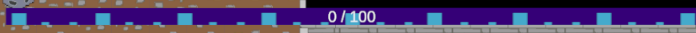

## Combat

The player attacks with a scythe swing. The attack is split in three timing phases based on attack speed:

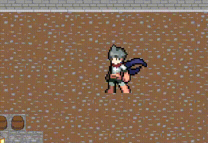

| Phase | Swing time | Gameplay effect |
| --- | --- | --- |
| Windup | 25% | Scythe is visible, collider still disabled |
| Attack | 50% | Collider is enabled and can damage enemies |
| Recovery | 25% | Collider disabled, player waits before attacking again |


```csharp
float swingDuration = 1f / player.aspd;
float windup = swingDuration * 0.25f;
float attackTime = swingDuration * 0.5f;
float recovery = swingDuration * 0.25f;
```

Each enemy can be hit once per swing because damaged targets are stored in a list during the attack.


## Waves and Enemies

The wave budget scales linearly with the wave number:

```csharp
spawnLimit = waves * 10;
```

Current enemy values:

| Enemy | HP | Attack | Speed | XP |Cost|
| --- | --- | --- | --- | --- |--- |
| Light Grunt | 12 | 10 | 3 | 12 |1
| Heavy Grunt | 24 | 20 | 2 | 22 |2
| Ranged Grunt | 9 | 15 | 2 | 18 |3

When an enemy collides with the player, it deals damage by current hp. On death, it increments the kill counter, decreases the active enemy count, doesnt gives its XP reward.

## Cards and Perks

On level-up, the card manager picks three random entries from the available pool.

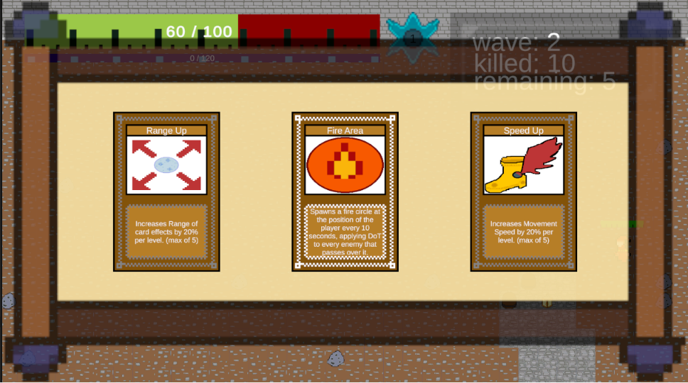

### Levelable Cards

| Card | Effect |image|
| --- | --- |---|
| Damage Up | Increases player damage by 20% per pick | 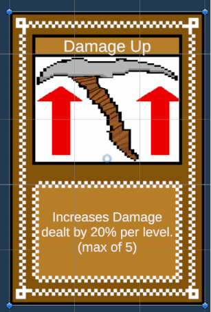 |
| Max Health Up | Increases max HP by 25% per pick |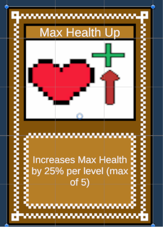 |
| Speed Up | Increases movement speed by 20% per pick | 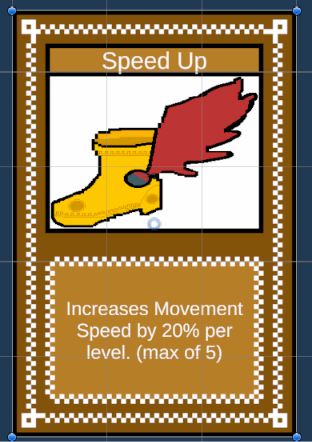 |
| Attack Speed Up | Increases by 20% attack speed per pick | 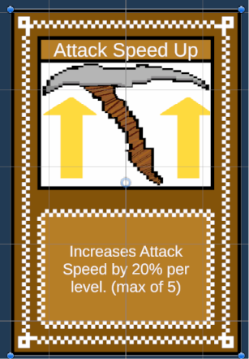 |
| Range Up | Adds 20% of base range to aoe cards per pick | 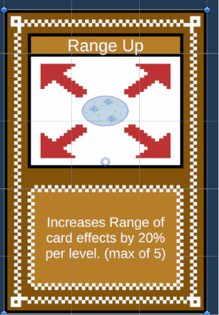 |

### Special Cards

| Card | Effect |image|
| --- | --- |---|
| Fire Aspect | Base attacks apply damage over time | 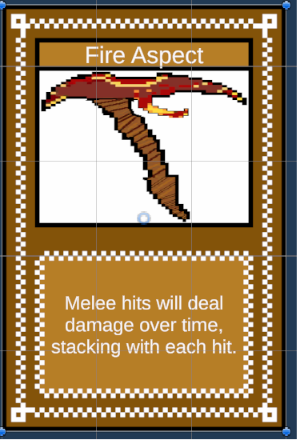 |
| Fire Area | Spawns a fire circle at the player's position every 10 seconds | 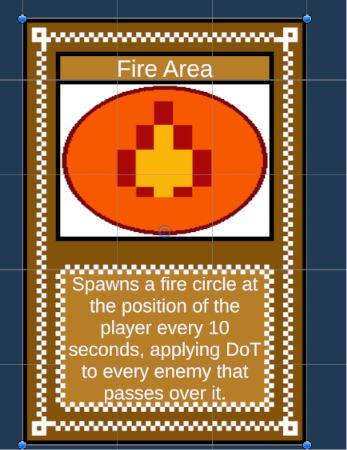 |
| Electro Aura | Periodically damages enemies around the player |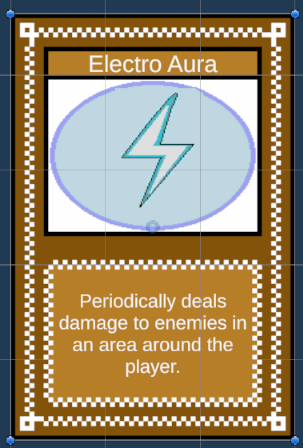 |
| Ice Aura | Slows enemies inside the aura | 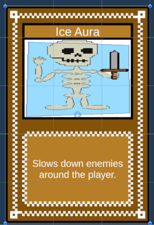 |
| Orbiting Blades | Summons two blades that rotate around the player | 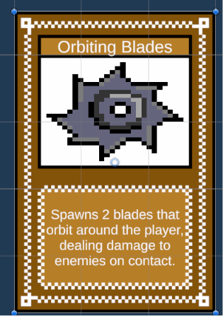 |
| Swarm | Doubles the wave budget, but halves enemy HP | 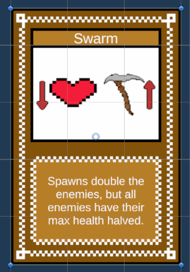 |
| Tenacity | Doubles damage under 40% HP but disables wave healing | 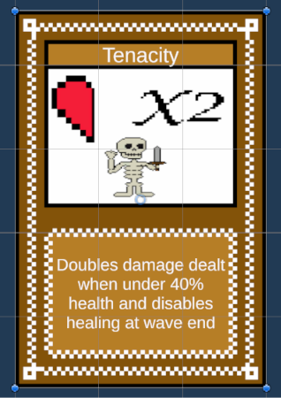 |

## Now a Bit of Maths

### Stat Scaling

Most direct stat upgrades use a simple 20% multiplier:

```csharp
player.playerInstance.atk += player.playerInstance.atk * 0.2f;
player.playerInstance.spd += player.playerInstance.spd * 0.2f;
player.playerInstance.hpMax += player.playerInstance.hpMax * 0.25f;
```

Attack speed and range are based on their original value rather than using the current value:

```csharp
player.playerInstance.aspd += baseAspd * 0.2f;
player.playerInstance.range += baseRange * 0.2f;
```


### Damage Over Time

```csharp
    public float damage;
    public float duration;
    public float tick;
```

 DoT damage is based on player attack, damage upgrades also make elemental effects stronger.
 DoT ticks a variable number of times set by the card, and can be applied multiple times to the same target.

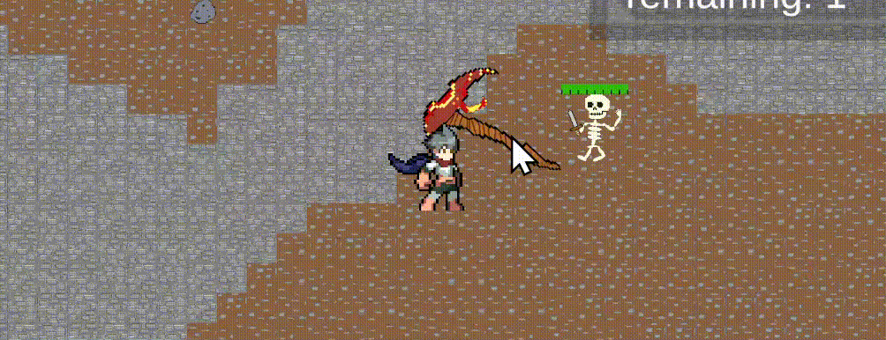

## How to Install

Download the executable file or visit the itch.io page.

[Itch Download](https://www.youtube.com/watch?v=dQw4w9WgXcQ&pp=ygUXbmV2ZXIgZ29ubmEgZ2l2ZSB5b3UgdXA%3D)

## Assets

NavMesh package 
Main character sprites modified from Ozzbit Games

## AI Usage Disclosure

AI tools were used for:

- Debug code
- Optimizing code with Unity specific functions No AI-generated images or sounds were directly used in the final game.
## License


This project is proprietary software.
The repository is public for portfolio and viewing purposes only.
Unauthorized use, reproduction, or redistribution is prohibited.

